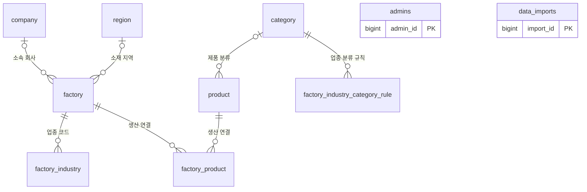
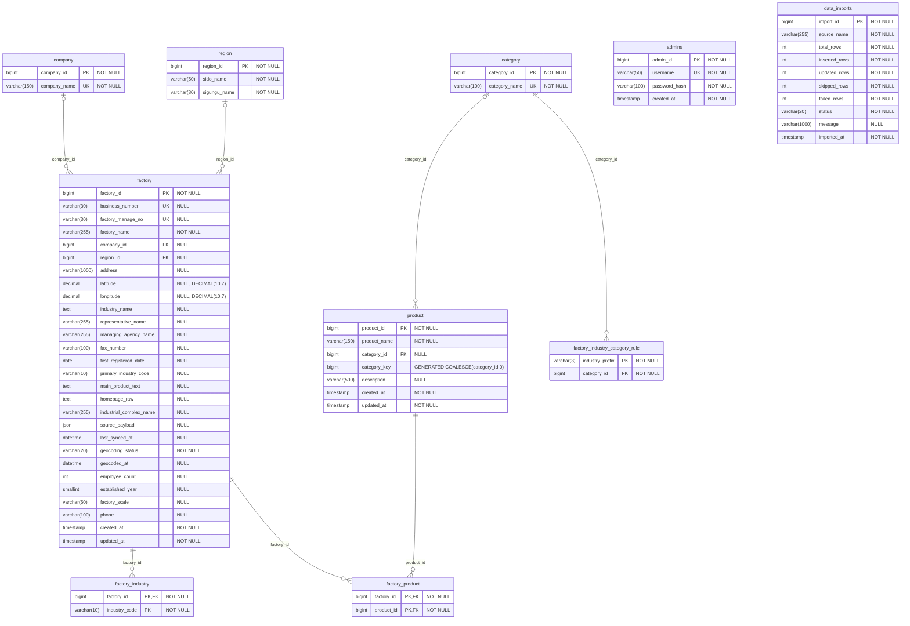
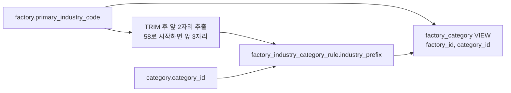

# FactoryPick ERD

현재 저장소의 `schema.sql`과 `category-schema.sql`을 기준으로 작성했습니다. 실제 운영 DB에 접속해 확인한 구조는 아닙니다. 물리 테이블 10개와 조회용 뷰 1개를 포함합니다.

- [기본 테이블 DDL](../src/main/resources/schema.sql)
- [업종 분류 테이블 및 뷰 DDL](../src/main/resources/category-schema.sql)
- [전체 ERD Mermaid 원본](./erd.mmd)

## PNG 이미지

- [전체 ERD 이미지 (4800 × 3400)](./images/FactoryPick-ERD.png)
- [공장 테이블 상세 이미지 (2240 × 2720)](./images/FactoryPick-factory-details.png)

전체 컬럼과 관계를 담은 별도 이미지입니다. 원본 크기로 열어 확대해서 볼 수 있습니다.

## 관계 요약

회사·지역·제품 분류는 선택 연결입니다. 공장 하나의 회사 및 지역은 각각 0개 또는 1개이며, 제품 하나의 카테고리도 0개 또는 1개입니다. 회사·지역·카테고리에 연결되는 하위 행은 0개 이상입니다. 공장과 제품은 `factory_product`를 통해 다대다 관계를 구성합니다. `admins`와 `data_imports`에는 다른 테이블을 참조하는 FK가 없습니다.

## 전체 물리 ERD

PK는 기본키, FK는 외래키, UK는 단일 컬럼 UNIQUE입니다. `NULL`은 선택 값, `NOT NULL`은 필수 값입니다. 복합 UNIQUE는 아래 제약조건 표에 따로 표시합니다.

## 주요 제약조건

| 테이블 | 제약조건 |
| --- | --- |
| company | `company_id` PK, `company_name` UNIQUE |
| region | `region_id` PK, `(sido_name, sigungu_name)` UNIQUE. 시·군·구 미지정은 빈 문자열 |
| category | `category_id` PK, `category_name` UNIQUE |
| factory | `factory_id` PK, `business_number` 및 `factory_manage_no` 각각 UNIQUE·NULL 허용 |
| factory_industry | `(factory_id, industry_code)` 복합 PK |
| product | `product_id` PK, `(product_name, category_key)` 복합 UNIQUE |
| factory_product | `(factory_id, product_id)` 복합 PK |
| admins | `admin_id` PK, `username` UNIQUE |
| data_imports | `import_id` PK |
| factory_industry_category_rule | `industry_prefix` PK, `category_id` 필수 FK |

- `product.category_key`는 `COALESCE(category_id, 0)`으로 생성되는 STORED 컬럼입니다. 미분류 제품도 동일한 제품명으로 중복 등록할 수 없습니다.
- 공장 좌표는 위도·경도가 모두 NULL이거나 모두 값이 있어야 합니다. 두 컬럼의 실제 타입은 `DECIMAL(10,7)`입니다.
- `geocoding_status`는 `PENDING`, `RESOLVED`, `NOT_FOUND`, `REVIEW`, `FAILED` 중 하나이며 기본값은 `PENDING`입니다.
- 공장 삭제 시 `factory_industry` 및 `factory_product`의 연결 행이 CASCADE로 삭제됩니다. 제품 삭제 시 해당 `factory_product` 연결 행도 CASCADE로 삭제됩니다. 그 외 FK에는 CASCADE가 지정되어 있지 않습니다.

## 업종 분류 뷰

`factory_category(factory_id, category_id)`는 저장 테이블이 아닌 VIEW입니다. `factory.primary_industry_code`를 분류 규칙에 조인해 계산합니다. 아래 화살표는 조회 의존성을 나타내며 FK가 아닙니다.

대표 업종코드를 TRIM한 뒤 앞 2자리를 사용하고, `58`로 시작하는 코드는 앞 3자리를 사용합니다. 규칙과 일치하지 않거나 대표 업종코드가 NULL인 공장은 뷰에서 제외됩니다. 현재 뷰 정의에는 `factory_industry`, `product`, `factory_product`와의 조인이 없습니다.

백엔드 README에 따르면 제품 관련 테이블은 기존 데이터 및 마이그레이션 호환성을 위해 보존됩니다. ERD에는 현재 DDL에 존재하는 이 테이블과 관계를 모두 포함했습니다. `migrations/README.md`의 제품 분류 통합 설명은 현재 뷰 SQL과 차이가 있어, 이 문서는 실행되는 SQL 정의를 기준으로 합니다.
